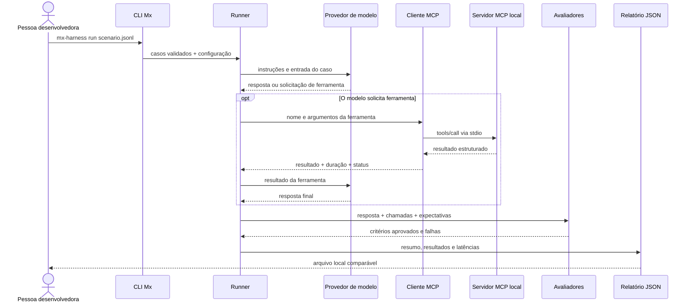

# Fluxo de uma avaliação com MCP

```mermaid
sequenceDiagram
    actor Dev as Pessoa desenvolvedora
    participant CLI as CLI Mx
    participant Run as Runner
    participant Model as Provedor de modelo
    participant MCP as Cliente MCP
    participant Server as Servidor MCP local
    participant Eval as Avaliadores
    participant Report as Relatório JSON

    Dev->>CLI: mx-harness run scenario.jsonl
    CLI->>Run: casos validados + configuração
    Run->>Model: instruções e entrada do caso
    Model-->>Run: resposta ou solicitação de ferramenta
    opt O modelo solicita ferramenta
        Run->>MCP: nome e argumentos da ferramenta
        MCP->>Server: tools/call via stdio
        Server-->>MCP: resultado estruturado
        MCP-->>Run: resultado + duração + status
        Run->>Model: resultado da ferramenta
        Model-->>Run: resposta final
    end
    Run->>Eval: resposta + chamadas + expectativas
    Eval-->>Run: critérios aprovados e falhas
    Run->>Report: resumo, resultados e latências
    Report-->>Dev: arquivo local comparável
```

O fluxo de ferramenta é opcional. A avaliação também deve cobrir casos em que o modelo responde sem chamar um MCP.
